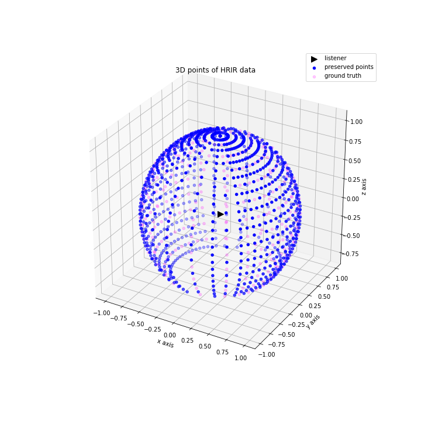
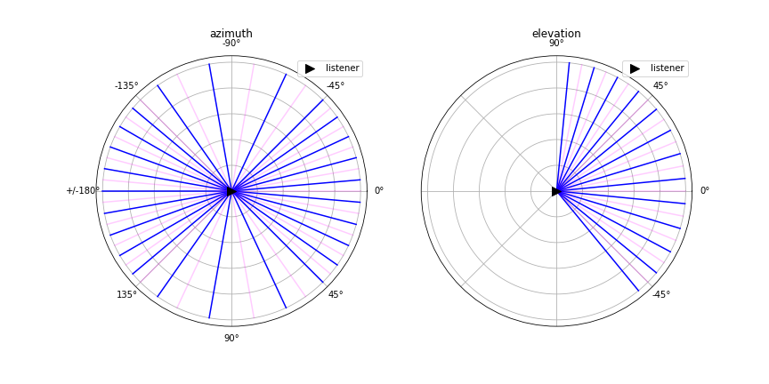

# Linear interpolation of HRIRs
This project tested four linear interpolations on the CIPIC dataset, where HRIRs of a target point can be interpolated by the adjacent azimuth or elevation pair, in the form of rectangular or polar for complex DFT coefficients.  
See code in the [Colab Notebook](https://colab.research.google.com/github/tiianhk/hrir-linear-interpolation/blob/main/Linear_Interpolation_CIPIC_HRIRs.ipynb).  

  
  

  

The 3D plot is the HRIR locations for one participant from the CIPIC dataset. Pink points were kept as ground truth data and would be interpolated by the azimuth pair (points on its left and right) and the elevation pair (points above and below it).  
Evaluation results showed that interpolating by elevation in the rectangular form had the least error.
